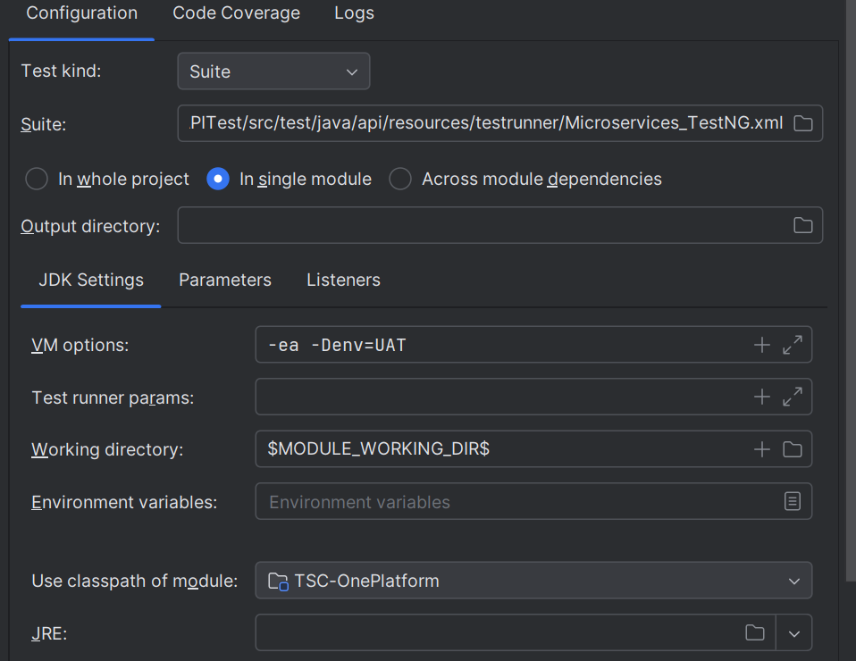

# TSC One Platform Java API Automation Slice
This Slice is an example for using the API testing framework, which is provided as part of the [`One Platform Java`](https://github.com/Tractor-Supply-Engineering-Productivity/OnePlatform-Java/tree/main). The api testing example runs a series of "scenarios" consisting of input Excel sheet for api, api chaining, db validation, and expected response validation. Each example can be validated for the expected results using json path extractor and also the responses can be extracted for later use in the runtime. 

This approach is used to improve the maintainability and make the code more readable  test along with the cucumber reporting. 

## Inputs for creating the API test 
Test Cases are consumed from a test data folder containing the XLSX files such as [src/test/java/api/resources/testdata/API_TestData.xlsx](src/test/java/api/resources/testdata/API_TestData.xlsx), this can be configured via the feature file from the background section, which is mandatory for the API test.

## Test Data Format 
The input for the API test is an Excel sheet that contains the following columns:

| Column Name      | Description                                                                                                                                                                                                      | Parameters                                                                                                                                                                                                                                                                                                                                                                                                                                           |
|------------------|------------------------------------------------------------------------------------------------------------------------------------------------------------------------------------------------------------------|------------------------------------------------------------------------------------------------------------------------------------------------------------------------------------------------------------------------------------------------------------------------------------------------------------------------------------------------------------------------------------------------------------------------------------------------------|
| DataBinding      | Refers to the column name binding data from the Excel sheet to the Feature file. This should be a Unique name or ID                                                                                              | Any (Alpha Numeric)                                                                                                                                                                                                                                                                                                                                                                                                                                  |
| Test_Case_Name   | This is the identifier for the test case. It is a recommended to be set as a scenarios/step name,  to each test case to differentiate it from others                                                             | Any (Alpha Numeric)                                                                                                                                                                                                                                                                                                                                                                                                                                  |
| BASE_URI         | The BASE_URI (or base URI) is the root URL of the API being tested. It typically represents the starting point of the URL path of the service.                                                                   | "The URL should be parameterized from the src/test/java/api/resources/env.properties.<br>Example Value:<br>Excel sheet -<br>BASEURI : WCS<br>env.properties -<br>WCS.UAT = https://uat.tractorsupply.com<br>WCS.Prod = https://tractorsupply.com"                                                                                                                                                                                                    |
| HTTP_Method      | This specifies the HTTP method or operation to be used for the API request. Each method serves a specific purpose for CRUD operations (Create, Read, Update, Delete).                                            | GET, POST, PUT, DELETE, PATCH                                                                                                                                                                                                                                                                                                                                                                                                                        |
| EndPoint         | The endpoint is the specific path appended to the BASE_URI that defines a specific resource or functionality of the API. It is used to access different parts of the API                                         | loginidentity                                                                                                                                                                                                                                                                                                                                                                                                                                        |
| EndPoint-******  | This functionality is used to parametrizing of EndPoint on runtime                                                                                                                                               | Framework allows EndPoint Parameterization<br/>Example: automate/**$name$**/browser/**$sessionID$** <br/>- EndPoint-name : session<br/>- EndPoint-sessionID : TY1117YMG<br/>- EndPoint-id : Fetch-BS_session_Id                                                                                                                                                                                                                                      |
| BodyFormat       | Refers to the format of the body content being sent in the API request                                                                                                                                           | RAW-JSON, FORM-DATA, BINARY, NODATA, X-WWW-FORM-URLENCODED                                                                                                                                                                                                                                                                                                                                                                                           |
| JsonName         | This refers to the Json request File name containing the request body                                                                                                                                            | Place the Json file under the path " src/test/java/api/resources/json"                                                                                                                                                                                                                                                                                                                                                                               |
| Headers-AuthType | This refers to the type of authentication mechanism used to validate the request's identity and authorization                                                                                                    | Basic Auth, Bearer Tokens, Oauth                                                                                                                                                                                                                                                                                                                                                                                                                     |
| Headers-******   | Headers are key-value pairs sent along with the HTTP request and response. They provide essential information about the request                                                                                  | Example:<br>Key and Value pair<br>Header-ContentType : application/json<br/>Header-Token : Fetch-Test_Api_001_Token                                                                                                                                                                                                                                                                                                                                  |
| Expected-******  | This functionality is the HTTP validate and assert the expected value to be returned from the API response.                                                                                                      | "For validating the status code, the direct method provided in the below example can be used and for validating a specific value, the Jsonpath and the expected value has to be provided in the specified format "<br>Example:<br>Key and Value pair<br>Expected-StatusCode : 200<br>Expected-userId : $.data.id \|\| 2<br/>Expected-resourceName : $.resourceName \|\| Attr-Name1"<br/>Expected-F_Name : $.first_name \|\| Fetch-DBname_first_name" |
| Extract-*****    | This functionality is used to retrieve specific data from the HTTP response after making an API request. By using JSONPath any specific values can be extracted API responses.                                   | Example:<br>Key and Value pair<br>Extract-Token : $.WCToken                                                                                                                                                                                                                                                                                                                                                                                          |
| Fetch-*****      | This functionality is used to retrieve the Extracted data from any method to use it during the run time                                                                                                          | Example : For Fetching a token from the Auth API and using it as headers:<br>Headers-Token: fetch-Test_Api_001_Token                                                                                                                                                                                                                                                                                                                                 |
| AddRequest-***** | This functionality is used to construct the request body dynamically with new key value pairs for POST, PUT, or PATCH API calls.                                                                                 | Example: <br>Key and Value pair<br>AddRequest-username : johndoe<br>AddRequest-password : secret123<br>AddRequest-email    : john@example.com                                                                                                                                                                                                                                                                                                        |
| Request-*****    | This functionality is used to replace the placeholders surrounded by $ icon (Ex: "id" : "$id$") in the request body dynamically for POST, PUT, or PATCH API calls. <br> >>> Refer below for clear understanding. | Example: <br>Key and Value pair<br>Request-username : johndoe<br>Request-password : secret123<br>Request-skuId1    : Attr-skuId1<br>Request-skuId2    : Attr-skuId2                                                                                                                                                                                                                                                                                  |
| Attr-*****       | This functionality is used to get the value associated to the Attribute(key) from the properties file based on the runtime environment.                                                                          | Example: For Getting a SkuId from prop file based on run time env.<br/> Expected-SkuId : Attr-ItemId1<br/> On Prop file:<br/>ItemId1.QA=98765<br/> ItemId1.UAT=12345                                                                                                                                                                                                                                                                                 |
| Vault-*****      | This functionality is used to get the secrets from the Azure Vault based on the runtime environment.                                                                                                             | Example: For Getting a Secrets from Vault.<br/> Expected-Pwd : Vault-api-pwd<br/> On Vault:<br/>api-pwd-QA : "xyz"<br/>api-pwd-UAT : "abc"                                                                                                                                                                                                                                                                                                           |

### How to use "Request-****"
```gherkin
Case 1: Parametrizing Placeholders Based on Environment
 - When parametrizing placeholders from a properties file based on the environment, ensure that the key should match with the placeholder of Request body and value in the Excel sheet should start with identifier 'Attr-***'. This approach allows for seamless mapping of placeholders to their respective values.
   Example:
   Request-skuId1 : Attr-ItemId1
   Request-type1 : Attr-ItemType1
   Request-productId : Attr-productId
   
Case 2: Hardcoding Placeholders with Direct Values
 - If you need to hardcode the value of a placeholder directly from the Excel sheet, follow the method below to assign the value directly to the corresponding placeholder.
   Example:
   Request-Id : TSC12345
   Request-Email : tsc@gmail.com
```

## Updating the Feature file

The feature file should be updated with the below background section to load the data from the Excel sheet.

```gherkin
Background: User is Loaded Data In
    Given Assigning Payload source "API_TestData.xlsx" and "Valid_TestData"
    And Load Data into Methods
```

## Example structure of xlsx. 

| Execute?     | DataBinding     | Test_Case_Name        | BASE_URI     | httpMethod     | endPoint                             | BodyFormat     | Expected-StatusCode     | JsonName                 | Extract-Token                     | Extract-WCTrustedToken                           | Expected-resourceName           |
|--------------|-----------------|-----------------------|--------------|:---------------|:-------------------------------------|----------------|-------------------------|--------------------------|-----------------------------------|--------------------------------------------------|---------------------------------|
| Yes          | Test_Api_001    | TC_API_001_Login      | TSC          | POST           | loginidentity                        | RAW-JSON       | 201                     | UAT.json                 | $.WCToken                         | $.WCTrustedToken                                 | $.resourceName\|\|loginidentity |
| **Execute?** | **DataBinding** | **Test_Case_Name**    | **BASE_URI** | **httpMethod** | **endPoint**                         | **BodyFormat** | **Expected-StatusCode** | **headers-Token**        | **headers-WCTrustedToken**        | **headers-Cookie**                               | **Extract-OrderId**             |
| Yes          | Test_Api_002    | TC_API_002_Get Cart   | TSC          | GET            | cart/@self?langId=-1&catalogId=10051 | NODATA         | 200                     | fetch-Test_Api_001_Token | fetch-Test_Api_001_WCTrustedToken | lpStoreNum=263; lpZipCodeNum=37064; lpZoneId=53; | $.orderId                       |
| **Execute?** | **DataBinding** | **Test_Case_Name**    | **BASE_URI** | **httpMethod** | **endPoint**                         | **BodyFormat** | **Expected-StatusCode** | **headers-AuthType**     | **headers-Username**              | **headers-Password**                             |
| Yes          | BS_Test_001     | BS Login Verification | BS           | GET            | automate/browsers                    | NODATA         | 200                     | Basic                    | BROWSERSTACK-USER                 | BROWSERSTACK-PASSWORD                            |

## Scripting the API test

To run the API test, Update your Feature file in the below format

- To execute the API test cases that are not dependent

```gherkin
 @Smoke
  Scenario Outline: Test the endpoints for Reqres Api's
    When Make API call to run "<DataBinding>"
    Then Validate the json response with the expected output "<DataBinding>"
    Examples:
      | DataBinding |
      | Test_003    |
      | Test_006    |
```

- To execute the chain of API test cases for E2E scenarios

```gherkin
 @Smoke  #API Chaining
Scenario Outline: Testing the API Chaining endpoints of Browser Stack
When Make API call to run "<DataBinding>"
Then Validate the json response with the expected output "<DataBinding>"
When Make API call to run "<SessionStatus>"
Then Validate the json response with the expected output "<SessionStatus>"
When Make API call to run "<UpdateSession>"
Then Validate the json response with the expected output "<UpdateSession>"

Examples:
| DataBinding | SessionStatus | UpdateSession |
| BS_Test_001 | BS_Test_002   | BS_Test_003   |
```
- To execute the API Test cases and perform a DB Validation

```gherkin
@Smoke @Test #DB Case
  Scenario Outline: Testing the Reqres Api endpoints and Validating the DB results
    When Make API call to run "<DataBinding>"
    Then Validate the json response with the expected output "<DataBinding>"
    And Establish the DB connection "WCS"
    Then Validate the DB results for query "<Query>" against "<ExpectedValue>"
    Examples:
      | DataBinding | Query           | ExpectedValue          |
      | Test_DB_002 | Sql_BopisQuery  | Test_DB_002_first_name |
```
**Note** : Sql_BopisQuery is the parameter from the src/test/resources/sqlQueries.properties file. Where the query can also have the parameterized values from the extracted values. 

```sql
select first_name from users where id = {{Test_DB_002_id}};
```
## Executing the API test cases

### 1. Execute from Testing XML File

You can execute the API test cases using the Testing XML file located at:

```bash
src/test/java/api/resources/testrunner/Microservices_TestNG.xml
```
or update the testng.xml file with the below content



### 2. Run the Maven Command from Terminal

```bash
mvn test  -DsuiteXmlFile=src/test/java/api/testrunner/Microservices_TestNG.xml -Denv=UAT

```

## Reporting

## Viewing the Allure Report

1. **Open the report**:
   Navigate to the directory where the Allure report is generated:
    ```sh
    target/allure-report/index.html
    ```

2. **View the report in a web browser**:
   Open `index.html` in your preferred web browser. You can do this directly from your file manager or via the command line (the command may vary based on your operating system):
    ```sh
    open target/allure-report/index.html
    ```

## Additional Notes
1. **How to find/create required JSON path**: Open below link for more understanding:
   ```sh
   open https://github.com/json-path/JsonPath
   ```
